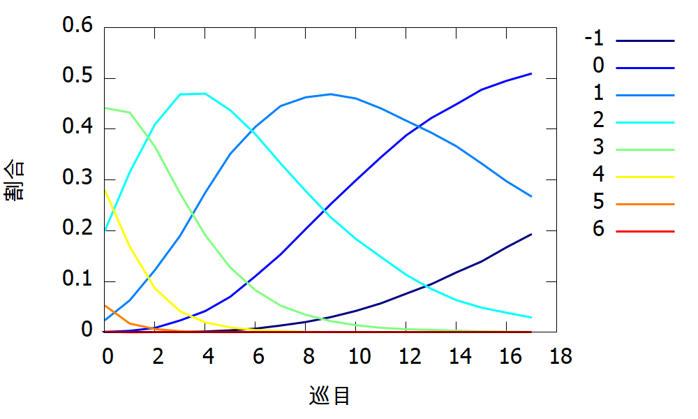
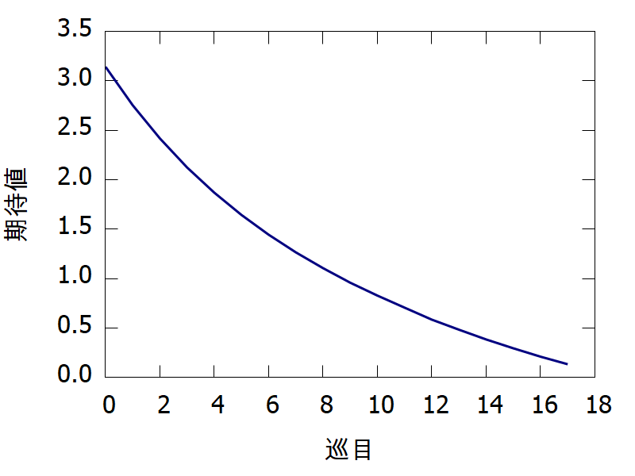

# YuukouhaiFuyouhaiCalculator
麻雀におけるシャンテン数および有効牌・不要牌を計算する。

[Read this in English.](README.md)

## 有効牌・不要牌
- 有効牌:
  - 最小の牌の交換回数であがるために必要な牌
  - それをツモるとシャンテン数が低下する牌
- 不要牌(余剰牌):
  - 最小の牌の交換回数であがるために不要な牌
  - それを捨ててもシャンテン数が変わらない牌

## 使用方法
1. 手牌を表す長さ34のint型配列を用意します。
- n番目の要素がn番目の牌の枚数を格納します。

||1|2|3|4|5|6|7|8|9|
|:--|:--|:--|:--|:--|:--|:--|:--|:--|:--|
|マンズ|0|1|2|3|4|5|6|7|8|
|ピンズ|9|10|11|12|13|14|15|16|17|
|ソーズ|18|19|20|21|22|23|24|25|26|
|字牌|27 (東)|28 (南)|29 (西)|30 (北)|31 (白)|32 (発)|33 (中)|||

- 例えば123m245779p13555zのような手牌の場合, 以下の配列を定義します。

```cpp
int hand[34] = {
    1,1,1,0,0,0,0,0,0, //Manzu
    0,1,0,1,1,0,2,0,1, //Pinzu
    0,0,0,0,0,0,0,0,0, //Souzu
    1,0,1,0,3,0,0 //Jihai
};
```

2. シャンテン数と有効牌・不要牌を計算します。
- (a) *n*面子一雀頭形:
```cpp
int Calsht::calc_lh(int* hand, int n, unsigned long long& disc, unsigned long long& wait)
```

> **NOTE:** 通常, *n*には手牌の枚数を3で割った値を代入する。

- (b) 七対子:
```cpp
int Calsht::calc_sp(int* hand, unsigned long long& disc, unsigned long long& wait)
```
- (c) 国士無双:
```cpp
int Calsht::calc_to(int* hand, unsigned long long& disc, unsigned long long& wait)
```
- (d) 一般形:
```cpp
int Calsht::operator()(int* hand, int n, int& mode, unsigned long long& disc, unsigned long long& wait)
```
> **NOTE:** *mode*はどのあがりパターンがシャンテン数の最小値を与えるかを表します。n面子一雀頭形の場合は1, 七対子の場合は2, 国士無双の場合は4です。複数のあがりパターンでシャンテン数が最小となる場合は, それらのビット論理和が*mode*となります。よって*mode*は1から7までの値をとりえます。

> **NOTE:** 各メソッドはシャンテン数+1の値を返します。

> **NOTE:** 参照渡しの引数*disc*と*wait*はそれぞれ不要牌と有効牌を表します。*wait*のn番目のビットの1/0はi番目の牌が有効牌であるかどうかを表します。同様に*disc*のn番目のビットの1/0はi番目の牌が不要牌であるかどうかを表します。

例として, 先に定義した手牌の有効牌と不要牌を計算します。この手牌の有効牌はピンズ(1から9)と東, 西で, 不要牌は東, 西, 白です。ソースコードは以下のようになります。

```cpp
#include <iostream>
#include <bitset>
#include "calsht_dw.hpp"

int main()
{
  // number of kinds of tiles
  constexpr int K = 34;

  CalshtDW calsht;
  int mode;
  int hand[K] = {
      1,1,1,0,0,0,0,0,0,// manzu
      0,1,0,1,1,0,2,0,1,// pinzu
      0,0,0,0,0,0,0,0,0,// souzu
      1,0,1,0,3,0,0// jihai
  };
  unsigned long long int disc;
  unsigned long long int wait;

  int sht = calsht(hand, 4, mode, disc, wait);

  std::cout << sht << std::endl;
  std::cout << mode << std::endl;
  std::cout << std::bitset<K>(disc) << std::endl;
  std::cout << std::bitset<K>(wait) << std::endl;

  return 0;
}
```
出力:
```
2
1
0010011000000000101011010000000000
0000011000000000111111111000000000
```

> **NOTE:** C++11以上に対応したコンパイラが必要です。

## サンプルプログラム
一人麻雀シミュレーションを行います。各巡目でシャンテン数を不変に保ち, 打牌後の有効牌の枚数が最大となるように打牌を行います。

```
$ gunzip index_dw_h.txt.gz index_dw_s.txt.gz
$ make
$ ./prob.out [局数(e.g. 1,000,000)]
$ cat result.txt
Number of Tiles         14
Total                   1000000
Time (msec.)            106499

Turn    Shanten Number (-1 - 6)                                         Hora    Tempai  Exp.
0       4       689     23224   194623  439207  285376  55254   1623    4e-06   0.000693        3.1576
1       36      3139    60055   312301  436206  169174  18856   233     3.6e-05 0.003175        2.76561
2       165     9550    118653  409619  368079  87961   5939    34      0.000165        0.009715        2.42371
3       575     22236   193284  461052  278799  42243   1805    6       0.000575        0.022811        2.12924
4       1585    43455   270484  467989  196448  19497   539     3       0.001585        0.04504 1.87492
5       3557    73558   341680  439988  132134  8916    167     0       0.003557        0.077115        1.651
6       7014    111731  397628  393033  86425   4115    54      0       0.007014        0.118745        1.45269
7       12342   155439  437312  337357  55610   1918    22      0       0.012342        0.167781        1.2743
8       19769   202505  460160  281105  35463   991     7       0       0.019769        0.222274        1.11299
9       29749   250970  466746  229544  22484   502     5       0       0.029749        0.280719        0.96557
10      42291   298561  460318  184296  14284   247     3       0       0.042291        0.340852        0.830474
11      57229   343412  444338  145635  9257    128     1       0       0.057229        0.400641        0.706667
12      74977   383949  420945  114180  5875    74      0       0       0.074977        0.458926        0.592249
13      94703   420040  392750  88629   3832    46      0       0       0.094703        0.514743        0.486985
14      116313  450680  362048  68448   2487    24      0       0       0.116313        0.566993        0.390188
15      140202  475546  330180  52435   1622    15      0       0       0.140202        0.615748        0.299774
16      165530  494708  298847  39820   1087    8       0       0       0.16553 0.660238        0.21625
17      192032  508775  268240  30169   780     4       0       0       0.192032        0.700807        0.138902
```

- 1行目は手牌の枚数, 2行目は局数, 3行目は実行時間(ミリ秒)を示しています。

- 6行目以降は, 左から順に巡目, 各シャンテン数の割合(-1から6), 和了率, 聴牌率, シャンテン数期待値を示しています。最終行に見ると一人麻雀の和了率が約19%であることがわかります。

- 各巡目に対するシャンテン数の割合と期待値を図示すると以下のようになります。




